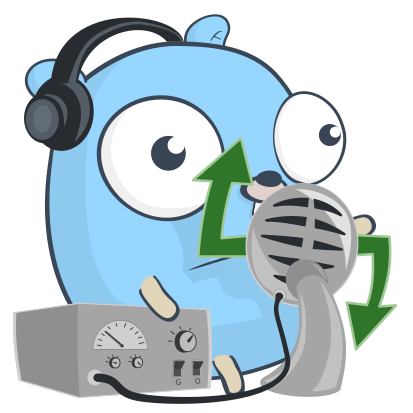

  
  <h1 align="center">Taterubot</h3>
  
Record audio messages and share them with your friends without leaving Discord! Whatsapp style

---

`Taterubot` is a Discord bot that allows recording voice messages and sending them on your server. 

## Showcase

## How to use it
1. Enter on the chosen channel. The bot will enter automatically.
2. Start speaking.
3. When you are done, leave the channel.
4. The bot will upload your voice message on the general channel.

## Requirements
- Discord application bot: create yours [here](https://discord.com/developers/applications).
- [ffmepg](https://ffmpeg.org/) installed in the host machine. It is needed to convert and manipulate audio files.
- Docker and docker-compose (only needed if running locally)

## Run `Taterubot` on your own machine (minimal setup)

- Rename .env.example to .env
- Put your discord token on BOT_TOKEN env variable.
- (Optionally) change LANGUAGE to **:gb:** or **:es:**
- Run *go mod download*
- Run *make local-infra*
- Run *go run main.go*

## Configuration settings (advanced setup)
You can modify the config.json file and adapt it to your needs.
- CHANNEL_NAME: Name of the voice channel where you want your audios to get recorded.
- BASE_PATH: Base path where the audio files are stored temporarily. 
- CLOUDAMQP_URL: Url that points to your AMQP broker.
- DATABASE_URL: Url that points to your Postgres DB.

## Guide: Deploy it in heroku for free
1. Create a worker dyno in heroku.
2. Add [CloudAMPQ addon](https://elements.heroku.com/addons/cloudamqp)
3. Add [Heroku postgres](https://www.heroku.com/postgres)
4. Set correct config vars for the bot token, AMPQ, postgres...
5. Add ffmepg buildpack. [howto](https://github.com/jonathanong/heroku-buildpack-ffmpeg-latest)
6. Deploy your code.
## Known bugs and limitations
- Cant really scale horizontally; There is an internal state using channels to manage the recording, cant handle the start and end of recording in different instances.
- Not meant for unstable connections: if you are outside with the phone and trying to record an audio and you have low signal, you most likely will lose that audio.

## Thanks to
WIP 👷👷👷
